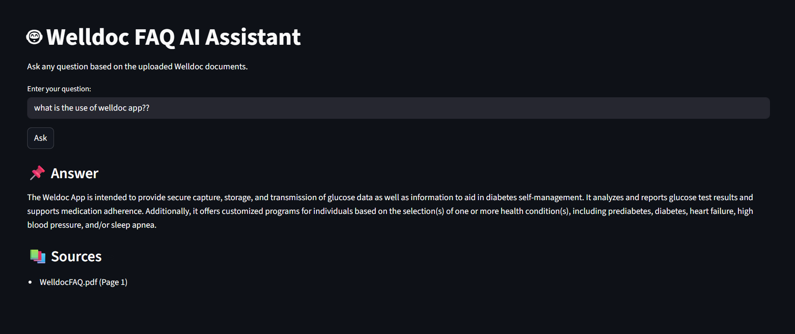
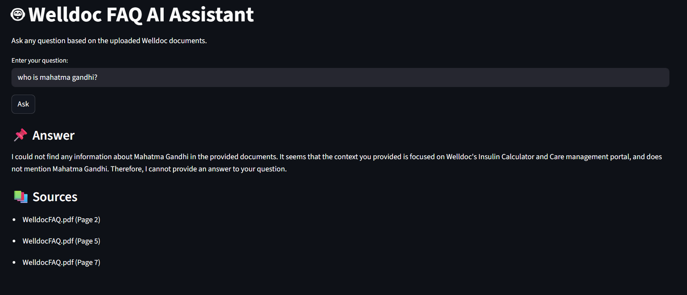

# QueryDocs AI — Hybrid RAG System

A Retrieval-Augmented Generation (RAG) AI assistant built using semantic search, hybrid retrieval, and explainable answer generation.

This system allows users to ask natural language questions and receive accurate, source-grounded answers strictly based on provided Welldoc PDF documents.

---

## 🚀 Features

- Cloud-deployable (no local LLM server required)
- Semantic search using vector embeddings
- Hybrid search (Semantic + Keyword ranking)
- Semantic chunking with overlap for better retrieval
- Source attribution (document + page number)
- Streamlit GUI for interactive querying
- Persistent vector database using ChromaDB

---

## System Architecture

```
PDF Documents
      ↓
Extraction (Page-Level)
      ↓
Semantic Chunking + Overlap
      ↓
Local Embeddings (Hugging Face sentence-transformers)
      ↓
ChromaDB (Persistent Vector Store)
      ↓
Hybrid Retrieval Layer
      ↓
LLM Answer Generation (Google Gemini API)
      ↓
Streamlit GUI
```

Embeddings run locally in-process via `sentence-transformers` (`all-MiniLM-L6-v2`) — no API key or external service needed for that step. Answer generation uses the **Google Gemini API** (`gemini-2.5-flash`), which is free-tier friendly and requires a `GEMINI_API_KEY`.

---

## 📂 Project Structure

```
QueryDocs-AI/
│
├── faq/                        # Input PDF documents
├── chroma_db/                  # Persistent vector database (committed for Streamlit Cloud)
│
├── extract_pdf.py              # PDF extraction logic
├── chunking.py                 # Semantic chunking with overlap
├── embedding.py                # Embedding + storage logic
├── build_vector_store.py       # Vector database builder
│
├── rag_query.py                # RAG pipeline test script (CLI)
├── app.py                      # Streamlit GUI
│
└── readme.md
```

---

## ⚙️ Local Setup

### 1️⃣ Clone Repository

```bash
git clone https://github.com/likhith-b-a/QueryDocs-AI.git
cd QueryDocs-AI
```

### 2️⃣ Create Virtual Environment

```bash
python -m venv venv
venv\Scripts\activate
```

### 3️⃣ Install Dependencies

```bash
pip install -r requirements.txt
```

### 4️⃣ Set your Gemini API key

Get a free key from [Google AI Studio](https://aistudio.google.com/apikey), then create a `.env` file in the project root:

```
GEMINI_API_KEY=your_key_here
```

---

## 📚 Build the Vector Database

Place your PDF documents inside `faq/`, then run:

```bash
python build_vector_store.py
```

This extracts PDF text, performs semantic chunking, generates embeddings, and stores vectors in `chroma_db/`. The repo already ships with a prebuilt `chroma_db/` for the included FAQ PDF, so this step is only needed if you change the source documents.

---

## 🖥 Run Locally

```bash
streamlit run app.py
```

---

## ☁️ Deploy to Streamlit Community Cloud

1. Push this repo to GitHub (including the `chroma_db/` folder — the vector store must ship with the app since Streamlit Cloud has no separate build step).
2. On [share.streamlit.io](https://share.streamlit.io), create a new app pointing at this repo, branch `main`, main file `app.py`.
3. In the app's **Settings → Secrets**, add:
   ```
   GEMINI_API_KEY = "your_key_here"
   ```
4. Deploy. If you later change the source PDFs, rebuild `chroma_db/` locally with `python build_vector_store.py` and commit the updated folder — Streamlit Cloud won't run the build script for you.

---

## Retrieval Pipeline

### Semantic Search

Vector similarity using embeddings generated locally via `sentence-transformers`.

### Keyword Boosting

Exact keyword matching improves retrieval precision.

---

## 🤖 Answer Generation

The LLM (Gemini):

- Uses retrieved context
- Returns concise grounded answers
- Displays source references

```
Answers strictly based on provided documents.
If answer not found, response is:
    I could not find this in the provided documents.
```

---

## 🧰 Tech Stack

- Python
- Google Gemini API (answer generation)
- Hugging Face `sentence-transformers` (local embeddings)
- ChromaDB (Vector Database)
- Streamlit

## 🖼 Demo Screenshots

### 💬 Example Query and Answer


